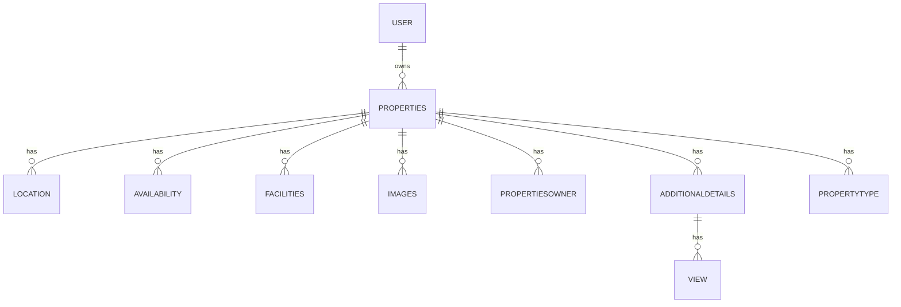

# Eluma Backend Documentation

## Overview
Eluma is a property management system built with NestJS and PostgreSQL. It provides a robust backend for managing property listings, user authentication, and property-related features.

## Tech Stack
- **Framework**: NestJS (v11)
- **Database**: PostgreSQL
- **Authentication**: JWT
- **ORM**: Prisma
- **Language**: TypeScript

## System Architecture

### Database Schema
The system consists of several interconnected models:



### Key Components

#### 1. User Management
- Role-based access control (admin/user)
- Secure authentication using JWT
- User profiles with basic information

#### 2. Property Management
- Comprehensive property listings
- Property types categorization
- Property details including:
  - Bedrooms and bathrooms
  - Price information (daily/monthly/yearly)
  - Location details
  - Availability scheduling

#### 3. Features
- Property images management
- Facilities tracking (WiFi, AC, Pool, etc.)
- Property owner information
- Additional details (parking, views, etc.)

## Database Structure

### Core Tables

#### User
- id (UUID)
- username
- email (unique)
- password
- role (admin/user)
- timestamps

#### Properties
- id (UUID)
- user_id (foreign key)
- type_id (foreign key)
- property details
- timestamps

#### Facilities
- Comprehensive list of amenities including:
  - WiFi
  - Air Conditioning
  - Pool
  - Beach Access
  - Gym
  - Security

#### AdditionalDetails
- Parking information
- Cleaning frequency
- Linen change policy
- View options

## Setup Instructions

1. Install dependencies:
```bash
npm install
```

2. Configure environment variables:
- Copy `.env.example` to `.env`
- Configure database URL and other settings

3. Run database migrations:
```bash
npx prisma migrate dev
```

4. Start the development server:
```bash
npm run start:dev
```

## API Endpoints

### Authentication
- POST /auth/login
- POST /auth/register
- POST /auth/refresh-token

### Properties
- GET /properties
- POST /properties
- GET /properties/:id
- PUT /properties/:id
- DELETE /properties/:id

### Users
- GET /users
- GET /users/:id
- PUT /users/:id

## Security Features
- JWT-based authentication
- Password hashing using bcrypt
- Role-based access control
- Input validation
- Rate limiting

## Contributing
1. Fork the repository
2. Create your feature branch
3. Commit your changes
4. Push to the branch
5. Create a Pull Request

## License
This project is licensed under the UNLICENSED license.

## Contact
For support or questions, please contact the development team.
